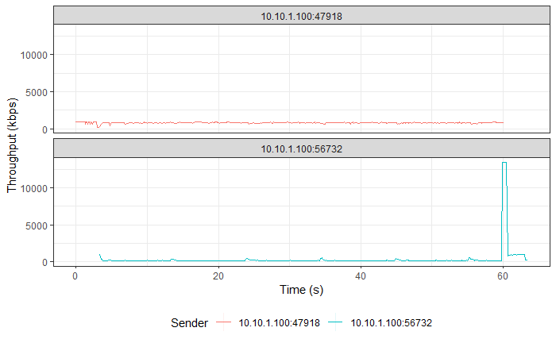
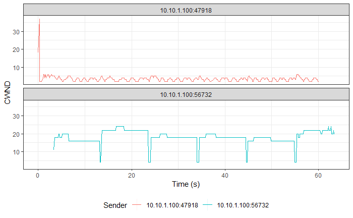
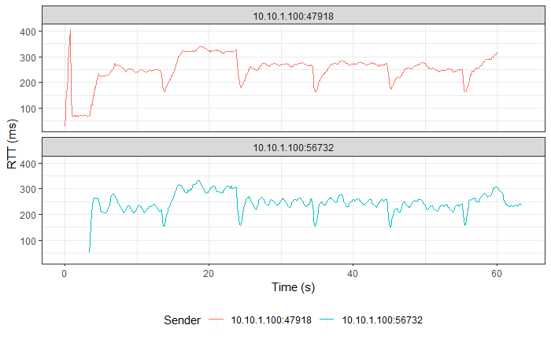

# Simultaneous TCP BBR and TCP Vegas Flows

> Legend:
>
> -   Romeo = Sender
> -   Juliet = Receiver

## Graphs

> NOTE: TCP Vegas followed by TCP BBR in all graphs.







## TCP BBR

> Ports:
>
> -   Sender
>     -   Control: 56730 (Vegas)
>     -   Flow: 56732 (BBR)
> -   Receiver: 5301

### Romeo's `iperf3` Output

```shell
[ ID] Interval           Transfer     Bandwidth       Retr
[  4]   0.00-60.00  sec  5.89 MBytes   823 Kbits/sec    0             sender
[  4]   0.00-60.00  sec  5.82 MBytes   813 Kbits/sec                  receiver
```

### Juliet's `iperf3` Output

```shell
[ ID] Interval           Transfer     Bandwidth
[  5]   0.00-60.24  sec  0.00 Bytes  0.00 bits/sec                  sender
[  5]   0.00-60.24  sec  5.82 MBytes   810 Kbits/sec                  receiver
```

## TCP Vegas

> Ports:
>
> -   Sender
>     -   Control: 47916 (Vegas)
>     -   Flow: 47918 (Vegas)
> -   Receiver: 5201

### Romeo's `iperf3` Output

```shell
[ ID] Interval           Transfer     Bandwidth       Retr
[  4]   0.00-60.00  sec  1.52 MBytes   213 Kbits/sec    0             sender
[  4]   0.00-60.00  sec  1.42 MBytes   198 Kbits/sec                  receiver
```

### Juliet's `iperf3` Output

```shell
[ ID] Interval           Transfer     Bandwidth
[  5]   0.00-60.32  sec  0.00 Bytes  0.00 bits/sec                  sender
[  5]   0.00-60.32  sec  1.42 MBytes   197 Kbits/sec                  receiver
```
