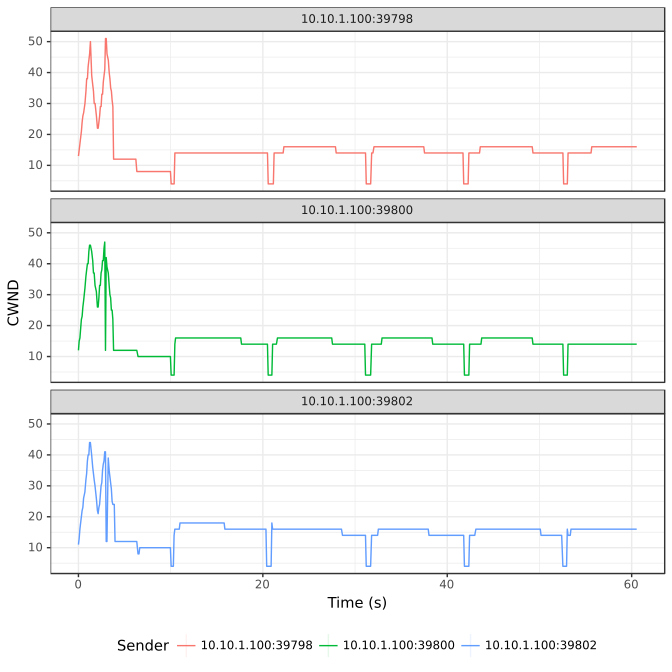

# TCP BBR

> Legend:
>
> -	Romeo = Sender
> -	Juliet = Receiver

## Graph



## Romeo's `iperf3` Output

> NOTE: Three parallel workflows were executed.

```shell
[ ID] Interval           Transfer     Bandwidth       Retr
[  4]   0.00-60.00  sec  2.41 MBytes   337 Kbits/sec   52             sender
[  4]   0.00-60.00  sec  2.22 MBytes   311 Kbits/sec                  receiver
[  6]   0.00-60.00  sec  2.47 MBytes   345 Kbits/sec   45             sender
[  6]   0.00-60.00  sec  2.29 MBytes   320 Kbits/sec                  receiver
[  8]   0.00-60.00  sec  2.56 MBytes   358 Kbits/sec   41             sender
[  8]   0.00-60.00  sec  2.39 MBytes   334 Kbits/sec                  receiver
[SUM]   0.00-60.00  sec  7.44 MBytes  1.04 Mbits/sec  138             sender
[SUM]   0.00-60.00  sec  6.90 MBytes   965 Kbits/sec                  receiver
```

## Juliet's `iperf3` Output

> NOTE: Three parallel workflows were executed.

```shell
[ ID] Interval           Transfer     Bandwidth
[  5]   0.00-60.54  sec  0.00 Bytes  0.00 bits/sec                  sender
[  5]   0.00-60.54  sec  2.22 MBytes   308 Kbits/sec                  receiver
[  7]   0.00-60.54  sec  0.00 Bytes  0.00 bits/sec                  sender
[  7]   0.00-60.54  sec  2.29 MBytes   317 Kbits/sec                  receiver
[  9]   0.00-60.54  sec  0.00 Bytes  0.00 bits/sec                  sender
[  9]   0.00-60.54  sec  2.39 MBytes   331 Kbits/sec                  receiver
[SUM]   0.00-60.54  sec  0.00 Bytes  0.00 bits/sec                  sender
[SUM]   0.00-60.54  sec  6.90 MBytes   956 Kbits/sec                  receiver
```

