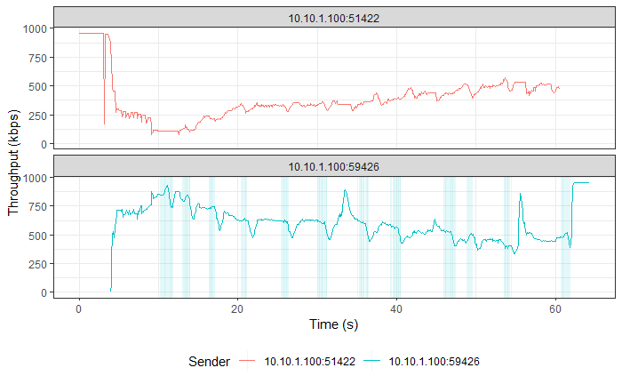
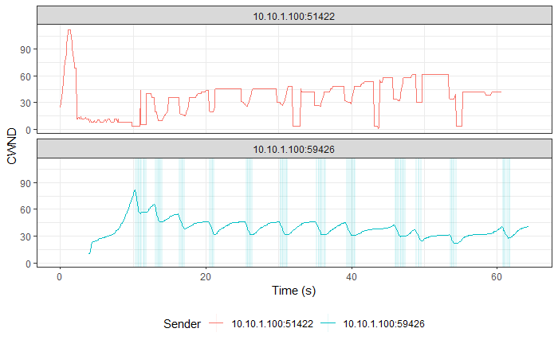
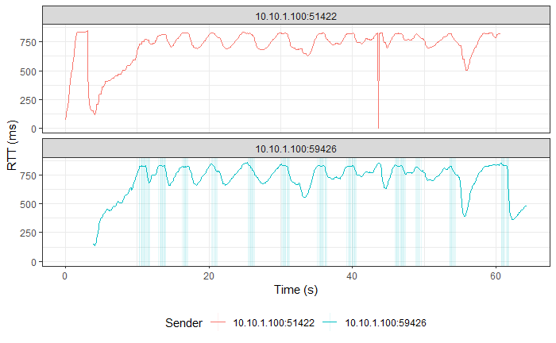

# Simultaneous TCP CUBIC and TCP BBR Flows

> Legend:
>
> -   Romeo = Sender
> -   Juliet = Receiver

## Graphs

> NOTE: TCP BBR followed by TCP CUBIC in both graphs.







## TCP CUBIC

> Ports:
>
> -   Sender
>     -   Control: 56424 (CUBIC)
>     -   Flow: 59426 (CUBIC)
> -   Receiver: 5301

### Romeo's `iperf3` Output

```shell
[ ID] Interval           Transfer     Bandwidth       Retr
[  4]   0.00-60.00  sec  4.69 MBytes   655 Kbits/sec   48             sender
[  4]   0.00-60.00  sec  4.52 MBytes   632 Kbits/sec                  receiver
```

### Juliet's `iperf3` Output

```shell
[ ID] Interval           Transfer     Bandwidth
[  5]   0.00-60.48  sec  0.00 Bytes  0.00 bits/sec                  sender
[  5]   0.00-60.48  sec  4.52 MBytes   626 Kbits/sec                  receiver
```

## TCP BBR

> Ports:
>
> -   Sender
>     -   Control: 51420 (CUBIC)
>     -   Flow: 51422 (BBR)
> -   Receiver: 5201

### Romeo's `iperf3` Output

```shell
[ ID] Interval           Transfer     Bandwidth       Retr
[  4]   0.00-60.00  sec  3.17 MBytes   443 Kbits/sec  113             sender
[  4]   0.00-60.00  sec  2.74 MBytes   383 Kbits/sec                  receiver
```

### Juliet's `iperf3` Output

```shell
[ ID] Interval           Transfer     Bandwidth
[  5]   0.00-60.86  sec  0.00 Bytes  0.00 bits/sec                  sender
[  5]   0.00-60.86  sec  2.74 MBytes   378 Kbits/sec                  receiver
```
