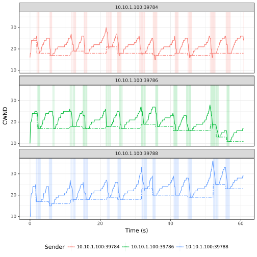

# TCP CUBIC

> Legend:
>
> -	Romeo = Sender
> -	Juliet = Receiver

## Graph



## Romeo's `iperf3` Output

> NOTE: Three parallel workflows were executed.

```shell
[ ID] Interval           Transfer     Bandwidth       Retr
[  4]   0.00-60.00  sec  2.34 MBytes   327 Kbits/sec   48             sender
[  4]   0.00-60.00  sec  2.29 MBytes   320 Kbits/sec                  receiver
[  6]   0.00-60.00  sec  2.23 MBytes   312 Kbits/sec   34             sender
[  6]   0.00-60.00  sec  2.18 MBytes   304 Kbits/sec                  receiver
[  8]   0.00-60.00  sec  2.52 MBytes   353 Kbits/sec   37             sender
[  8]   0.00-60.00  sec  2.46 MBytes   345 Kbits/sec                  receiver
[SUM]   0.00-60.00  sec  7.10 MBytes   992 Kbits/sec  119             sender
[SUM]   0.00-60.00  sec  6.93 MBytes   969 Kbits/sec                  receiver
```

## Juliet's `iperf3` Output

> NOTE: Three parallel workflows were executed.

```shell
[ ID] Interval           Transfer     Bandwidth
[  5]   0.00-60.86  sec  0.00 Bytes  0.00 bits/sec                  sender
[  5]   0.00-60.86  sec  2.29 MBytes   315 Kbits/sec                  receiver
[  7]   0.00-60.86  sec  0.00 Bytes  0.00 bits/sec                  sender
[  7]   0.00-60.86  sec  2.18 MBytes   300 Kbits/sec                  receiver
[  9]   0.00-60.86  sec  0.00 Bytes  0.00 bits/sec                  sender
[  9]   0.00-60.86  sec  2.46 MBytes   340 Kbits/sec                  receiver
[SUM]   0.00-60.86  sec  0.00 Bytes  0.00 bits/sec                  sender
[SUM]   0.00-60.86  sec  6.93 MBytes   955 Kbits/sec                  receiver
```

