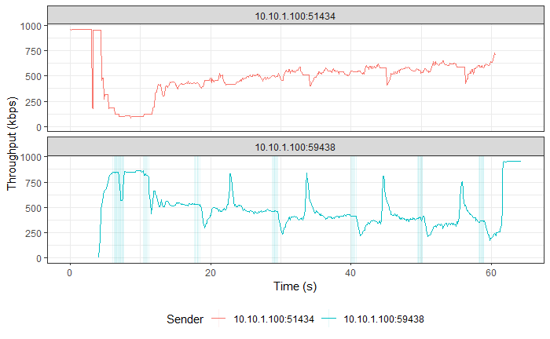
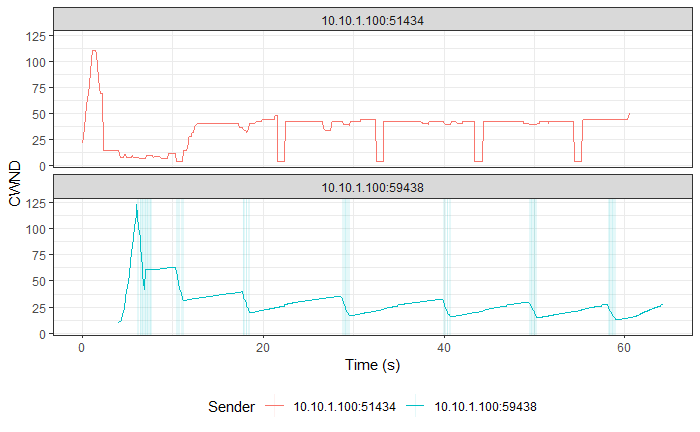
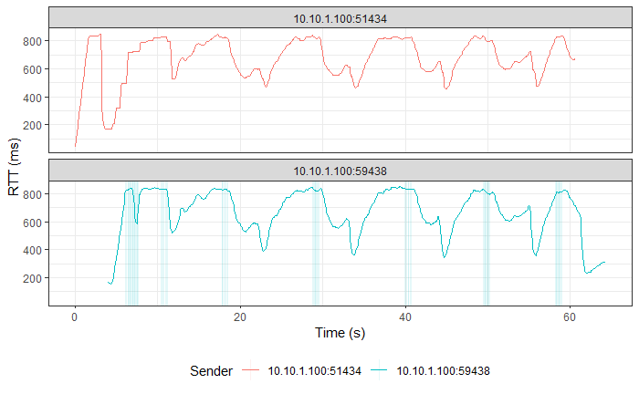

# Simultaneous TCP Reno and TCP BBR Flows

> Legend:
>
> -   Romeo = Sender
> -   Juliet = Receiver

## Graphs

> NOTE: TCP BBR followed by TCP Reno in both graphs.







## TCP Reno

> Ports:
>
> -   Sender
>     -   Control: 59436 (CUBIC)
>     -   Flow: 59438 (Reno)
> -   Receiver: 5301

### Romeo's `iperf3` Output

```shell
[ ID] Interval           Transfer     Bandwidth       Retr
[  4]   0.00-60.00  sec  3.91 MBytes   546 Kbits/sec   72             sender
[  4]   0.00-60.00  sec  3.70 MBytes   517 Kbits/sec                  receiver
```

### Juliet's `iperf3` Output

```shell
[ ID] Interval           Transfer     Bandwidth
[  5]   0.00-60.32  sec  0.00 Bytes  0.00 bits/sec                  sender
[  5]   0.00-60.32  sec  3.70 MBytes   514 Kbits/sec                  receiver
```

## TCP BBR

> Ports:
>
> -   Sender
>     -   Control: 51432 (CUBIC)
>     -   Flow: 51434 (BBR)
> -   Receiver: 5201

### Romeo's `iperf3` Output

```shell
[ ID] Interval           Transfer     Bandwidth       Retr
[  4]   0.00-60.00  sec  3.99 MBytes   558 Kbits/sec   67             sender
[  4]   0.00-60.00  sec  3.60 MBytes   503 Kbits/sec                  receiver
```

### Juliet's `iperf3` Output

```shell
[ ID] Interval           Transfer     Bandwidth
[  5]   0.00-60.72  sec  0.00 Bytes  0.00 bits/sec                  sender
[  5]   0.00-60.72  sec  3.60 MBytes   497 Kbits/sec                  receiver
```
