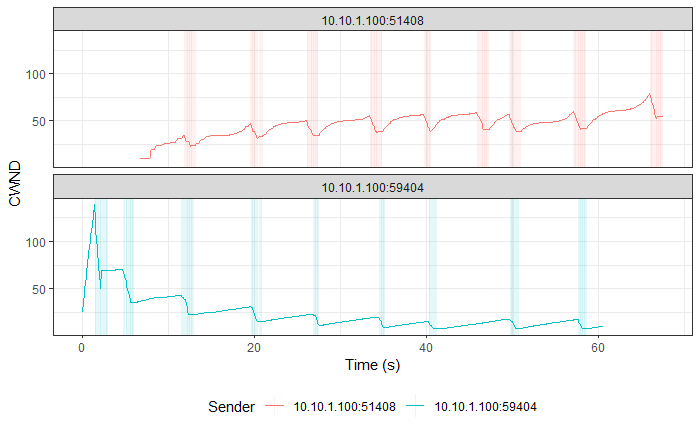

# Simultaneous TCP Reno and TCP CUBIC Flows

> Legend:
>
> -   Romeo = Sender
> -   Juliet = Receiver

## Graphs

> NOTE: TCP CUBIC followed by TCP Reno in all graphs.





## TCP Reno

> Ports:
>
> -   Sender
>     -   Control: 59402 (CUBIC)
>     -   Flow: 59404 (Reno)
> -   Receiver: 5301

### Romeo's `iperf3` Output

```shell
[ ID] Interval           Transfer     Bandwidth       Retr
[  4]   0.00-60.00  sec  2.93 MBytes   410 Kbits/sec   86             sender
[  4]   0.00-60.00  sec  2.65 MBytes   370 Kbits/sec                  receiver
```

### Juliet's `iperf3` Output

```shell
[ ID] Interval           Transfer     Bandwidth
[  5]   0.00-60.80  sec  0.00 Bytes  0.00 bits/sec                  sender
[  5]   0.00-60.80  sec  2.65 MBytes   365 Kbits/sec                  receiver
```

## TCP CUBIC

> Ports:
>
> -   Sender
>     -   Control: 51406 (CUBIC)
>     -   Flow: 51408 (CUBIC)
> -   Receiver: 5201

### Romeo's `iperf3` Output

```shell
[ ID] Interval           Transfer     Bandwidth       Retr
[  4]   0.00-60.00  sec  5.14 MBytes   718 Kbits/sec   42             sender
[  4]   0.00-60.00  sec  5.07 MBytes   709 Kbits/sec                  receiver
```

### Juliet's `iperf3` Output

```shell
[ ID] Interval           Transfer     Bandwidth
[  5]   0.00-60.68  sec  0.00 Bytes  0.00 bits/sec                  sender
[  5]   0.00-60.68  sec  5.07 MBytes   701 Kbits/sec                  receiver
```
