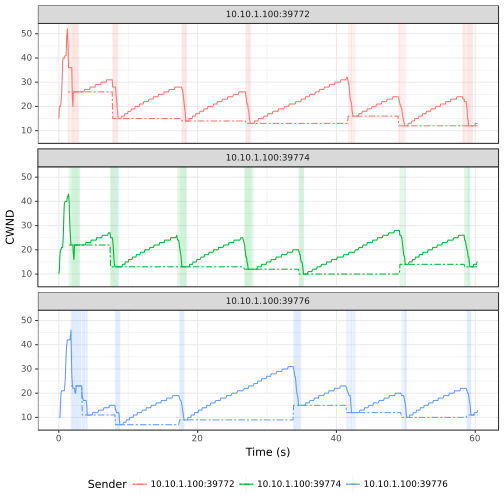

# TCP Reno

> Legend:
>
> -	Romeo = Sender
> -	Juliet = Receiver

## Graph



## Romeo's `iperf3` Output

> NOTE: Three parallel flows were executed.

```shell
[ ID] Interval           Transfer     Bandwidth       Retr
[  4]   0.00-60.00  sec  2.66 MBytes   372 Kbits/sec   37             sender
[  4]   0.00-60.00  sec  2.56 MBytes   358 Kbits/sec                  receiver
[  6]   0.00-60.00  sec  2.38 MBytes   333 Kbits/sec   30             sender
[  6]   0.00-60.00  sec  2.28 MBytes   319 Kbits/sec                  receiver
[  8]   0.00-60.00  sec  2.16 MBytes   301 Kbits/sec   30             sender
[  8]   0.00-60.00  sec  2.05 MBytes   287 Kbits/sec                  receiver
[SUM]   0.00-60.00  sec  7.20 MBytes  1.01 Mbits/sec   97             sender
[SUM]   0.00-60.00  sec  6.89 MBytes   964 Kbits/sec                  receiver
```

## Juliet's `iperf3` Output

> NOTE: Three parallel flows were executed.

```shell
[ ID] Interval           Transfer     Bandwidth
[  5]   0.00-60.48  sec  0.00 Bytes  0.00 bits/sec                  sender
[  5]   0.00-60.48  sec  2.56 MBytes   355 Kbits/sec                  receiver
[  7]   0.00-60.48  sec  0.00 Bytes  0.00 bits/sec                  sender
[  7]   0.00-60.48  sec  2.28 MBytes   317 Kbits/sec                  receiver
[  9]   0.00-60.48  sec  0.00 Bytes  0.00 bits/sec                  sender
[  9]   0.00-60.48  sec  2.05 MBytes   284 Kbits/sec                  receiver
[SUM]   0.00-60.48  sec  0.00 Bytes  0.00 bits/sec                  sender
[SUM]   0.00-60.48  sec  6.89 MBytes   956 Kbits/sec                  receiver
```

