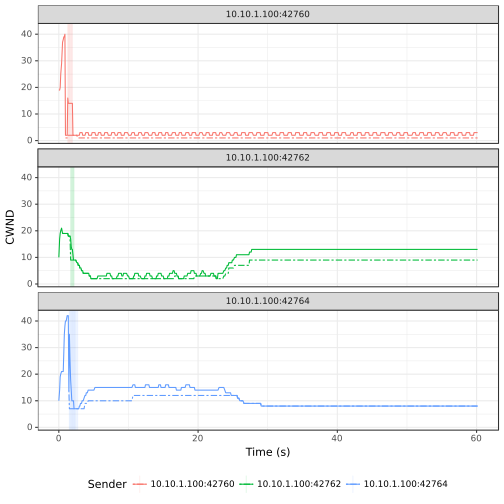

# TCP Vegas

> Legend:
>
> -	Romeo = Sender
> -	Juliet = Receiver

## Graph



## Romeo's `iperf3` Output

> NOTE: Three parallel workflows were executed.

```shell
[ ID] Interval           Transfer     Bandwidth       Retr
[  4]   0.00-60.00  sec   994 KBytes   136 Kbits/sec   10             sender
[  4]   0.00-60.00  sec   894 KBytes   122 Kbits/sec                  receiver
[  6]   0.00-60.00  sec  2.70 MBytes   378 Kbits/sec    1             sender
[  6]   0.00-60.00  sec  2.68 MBytes   374 Kbits/sec                  receiver
[  8]   0.00-60.00  sec  3.43 MBytes   480 Kbits/sec   19             sender
[  8]   0.00-60.00  sec  3.33 MBytes   465 Kbits/sec                  receiver
[SUM]   0.00-60.00  sec  7.10 MBytes   993 Kbits/sec   30             sender
[SUM]   0.00-60.00  sec  6.88 MBytes   961 Kbits/sec                  receiver
```

## Juliet's `iperf3` Output

> NOTE: Three parallel workflows were executed.

```shell
[ ID] Interval           Transfer     Bandwidth
[  5]   0.00-60.31  sec  0.00 Bytes  0.00 bits/sec                  sender
[  5]   0.00-60.31  sec   894 KBytes   121 Kbits/sec                  receiver
[  7]   0.00-60.31  sec  0.00 Bytes  0.00 bits/sec                  sender
[  7]   0.00-60.31  sec  2.68 MBytes   372 Kbits/sec                  receiver
[  9]   0.00-60.31  sec  0.00 Bytes  0.00 bits/sec                  sender
[  9]   0.00-60.31  sec  3.33 MBytes   463 Kbits/sec                  receiver
[SUM]   0.00-60.31  sec  0.00 Bytes  0.00 bits/sec                  sender
[SUM]   0.00-60.31  sec  6.88 MBytes   956 Kbits/sec                  receiver
```

