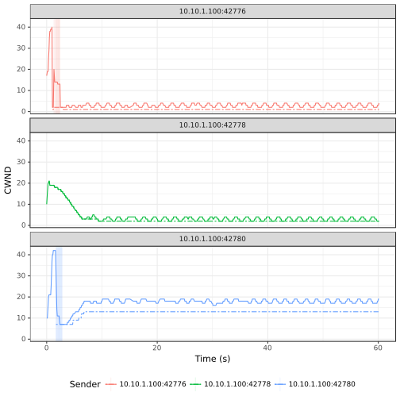

# TCP Vegas

> Legend:
>
> -     Romeo = Sender
> -     Juliet = Receiver

## Graph



## Romeo's `iperf3` Output

> NOTE: Three parallel workflows were executed.

```shell
[ ID] Interval           Transfer     Bandwidth       Retr
[  4]   0.00-60.00  sec   996 KBytes   136 Kbits/sec   11             sender
[  4]   0.00-60.00  sec   895 KBytes   122 Kbits/sec                  receiver
[  6]   0.00-60.00  sec  1.06 MBytes   148 Kbits/sec    0             sender
[  6]   0.00-60.00  sec  1.01 MBytes   142 Kbits/sec                  receiver
[  8]   0.00-60.00  sec  5.08 MBytes   710 Kbits/sec   18             sender
[  8]   0.00-60.00  sec  4.99 MBytes   697 Kbits/sec                  receiver
[SUM]   0.00-60.00  sec  7.10 MBytes   993 Kbits/sec   29             sender
[SUM]   0.00-60.00  sec  6.87 MBytes   961 Kbits/sec                  receiver
```

## Juliet's `iperf3` Output

> NOTE: Three parallel workflows were executed.

```shell
[ ID] Interval           Transfer     Bandwidth
[  5]   0.00-60.30  sec  0.00 Bytes  0.00 bits/sec                  sender
[  5]   0.00-60.30  sec   895 KBytes   122 Kbits/sec                  receiver
[  7]   0.00-60.30  sec  0.00 Bytes  0.00 bits/sec                  sender
[  7]   0.00-60.30  sec  1.01 MBytes   141 Kbits/sec                  receiver
[  9]   0.00-60.30  sec  0.00 Bytes  0.00 bits/sec                  sender
[  9]   0.00-60.30  sec  4.99 MBytes   693 Kbits/sec                  receiver
[SUM]   0.00-60.30  sec  0.00 Bytes  0.00 bits/sec                  sender
[SUM]   0.00-60.30  sec  6.87 MBytes   956 Kbits/sec                  receiver
```

